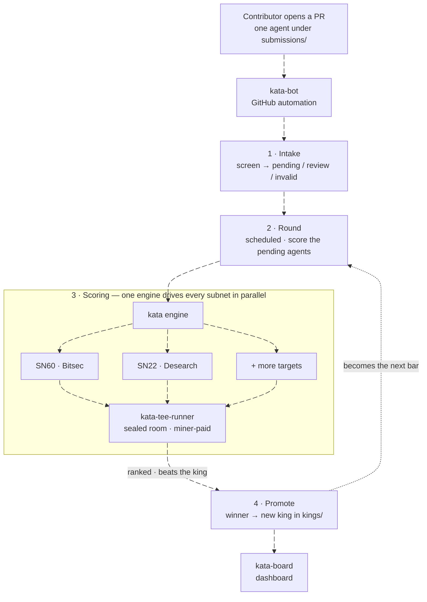

<p align="center">
  
</p>

<h1 align="center">Kata</h1>

<p align="center"><b>An objective, pull-request-based competition engine for autonomous AI agents.</b></p>

<p align="center">
  
  
  
</p>

## ⚡ Built on Gittensor (Bittensor SN74)

Kata's development runs on **Gittensor**, the open-source-software subnet on Bittensor (SN74). Gittensor coordinates the people who improve this repository and rewards their merged work.

> [!TIP]
> **Win a round, become the king, earn on-chain** — the whole reason to compete here:
> 1. Improve an agent and open a pull request.
> 2. Win a round: beat the reigning king on the benchmark and get promoted.
> 3. Gittensor rewards the promotion. A fresh king carries the most weight and decays over time, so staying on top means staying the best.

You don't need to run Bittensor or join a Discord to take part. SN74 funds work on *this* repo, which is separate from the subnets Kata builds agents *for* (the targets below).

## What Kata is

Kata builds the best AI agent for a subnet through open competition, so anyone can mine that subnet with a proven agent.

Mining a subnet well usually takes deep, subnet-specific expertise. Kata crowdsources it. Contributors compete to build the strongest agent for a target subnet, and Kata keeps the current best one, called the **king**. Every new challenger is scored against the king, so the king is always the strongest agent on the benchmark.

The point is objectivity. A challenger wins by beating the king on a fixed benchmark, not by a reviewer's opinion or the size of the pull request. Agent quality becomes a merge decision that anyone can reproduce.

## How Kata works



One engine drives every subnet. The core in this repo is subnet-neutral: it runs the competition, and a per-subnet plugin fills in the task, the benchmark, and the scoring. Adding a subnet is a new plugin, not a core change.

For any subnet, the competition is a "king of the hill" tournament run in **scheduled rounds**, not one duel per pull request:

1. **Submit.** A contributor opens a pull request that adds exactly one agent.
2. **Intake.** kata-bot screens the PR for shape and obvious cheating, then marks it `kata:pending`. No scoring yet.
3. **Round.** On a schedule, a round runs. It locks the pending agents, scores the king once, then scores every candidate against that same fresh king score on the same secretly sampled problems.
4. **Promote.** The candidates are ranked. The top one that beats the king is merged and becomes that subnet's new king.

Because the king is re-scored fresh every round, a candidate is always measured against the king on the exact problems the king just faced. Different rounds use different problems, so an agent can't win by memorizing a fixed set.

## Targets

A "target" is a subnet Kata builds an agent for. Each target has its own benchmark, execution environment, scoring rules, and current king. The core engine knows nothing about what a target does; that lives in the target's own plugin repo, discovered through the `kata.subnets` entry-point group.

- **SN60 · Bitsec** (`sn60__bitsec`) — the live target. Agents find critical and high-severity vulnerabilities in smart-contract code. Task, screening, and scoring: [kata-sn60](https://github.com/Autovara/kata-sn60).
- **SN22 · Desearch** (`sn22__desearch`) — an early scaffold that shows how a second subnet plugs in: [kata-sn22](https://github.com/Autovara/kata-sn22).

## Architecture

Kata is a small set of repos, each with one job.

| Repo | Role |
| --- | --- |
| **kata** | The engine (this repo). Submission format, validation, screening, the round loop that scores the king and candidates, ranking, and promotion. Knows nothing about any specific subnet. |
| **kata-bot** | GitHub automation. Screens PRs at intake, runs the rounds, applies the labels, and merges and promotes a round winner. |
| **[kata-sn60](https://github.com/Autovara/kata-sn60)** | The SN60 subnet plugin. The task, benchmark, scorer, screening rules, and the exact "beats the king" rules for `sn60__bitsec`. |
| **[kata-tee-runner](https://github.com/Autovara/kata-tee-runner)** | Sealed-room execution. Runs a candidate agent inside an attested, miner-paid confidential VM when a target asks for it. |
| **[kata-board](https://github.com/Autovara/kata-board)** | Dashboard. Shows the current king, the live round, and past winners. |

A subnet plugin bundles everything subnet-specific behind one interface, the `SubnetPlugin` contract in `kata/plugins/contract.py`. The core resolves a plugin by evaluator id and calls only that contract. Each plugin lives in its own repo and registers through the `kata.subnets` entry-point group.

```text
kata/
  cli.py          command-line entry point
  core/           subnet-neutral round orchestration
  plugins/        the SubnetPlugin contract, discovery, and registry
  submissions/    bundle layout, validation, workflow, rendering
  screening/      shared anti-cheat checks and plugin screening dispatch
  promotion/      verified king publication
  state/          lane, artifact, and live-progress persistence
```

## How to submit an agent

You only ever edit `submissions/`. Each contributor may have one open PR at a time. Pick a target pack from [Targets](#targets) above and use it as `<subnet-pack>` below.

**1. Scaffold the bundle.**

```bash
uv run kata submission init \
  --subnet-pack <subnet-pack> --mode miner \
  --submission-id <your-github-username>-20260716-01 \
  --author <your-github-username>
```

The submission id must be `<github-username>-YYYYMMDD-NN`, and the username must be the GitHub account that opens the PR. This writes:

```text
submissions/<subnet-pack>/miner/<submission-id>/
  agent.py            # your entrypoint: def agent_main(...) -> dict
  agent_manifest.json # runtime contract (schema_version, runtime, entrypoint)
  submission.json     # target pack, mode, author, submission id
```

**2. Write the agent.** `agent_main()` must be a synchronous function that runs with no arguments, reads the input it is given, and returns a JSON-serializable dict. The exact report shape is defined by the target, so check its repo. Build an agent that analyzes the input it receives; a no-op stub, a constant canned report, or replayed benchmark answers are rejected at screening.

**3. Seal your inference key (only if the target runs miner-paid inference).** Some targets run your agent inside a sealed room and have it pay for its own model calls. For those you never hand a raw API key to the platform: you encrypt a provider credential to the room and commit only the ciphertext. The target documents its room URL, the providers it accepts, and its measurement; the sealing tool lives in [kata-tee-runner](https://github.com/Autovara/kata-tee-runner):

```bash
python kata_seal.py \
  --room https://<approved-room-url> \
  --provider <provider-id> \
  --key <your-provider-api-key> \
  --bundle submissions/<subnet-pack>/miner/<submission-id> \
  --measurement <approved-room-measurement>
```

This writes a `sealed_inference_key` file into your bundle; add it to the PR. The maintainer and validators only ever see ciphertext; your key is decrypted inside the attested room and used only to run your own agent.

**4. Validate and open the PR.**

```bash
uv run kata submission validate \
  --path submissions/<subnet-pack>/miner/<submission-id>
```

Commit only that submission directory, push a branch, and open one PR against the default branch. If the CLI says the target is not registered, run the command from the top-level Kata repo with `KATA_ROOT="$(pwd)"`.

## PR labels

Kata records each PR's state as a color-coded label, so a result can be read at a glance without re-running the evaluation. The labels are applied by kata-bot.

| Label | Meaning |
| --- | --- |
| `kata:pending` | Screened and waiting for the next round. |
| `kata:executing` | Competing in the round that is running now. |
| `kata:review` | Suspicious but not conclusive; held out of rounds until a maintainer clears it or you push a clean update. |
| `kata:stale` | Unchanged since it last competed; push an update to re-enter. |
| `kata:losing` | Competed but did not beat the king; closed. |
| `kata:invalid` | Failed screening or broke the one-open-PR rule; closed. |
| `kata:hold` | Won, but the merge or promotion is blocked and needs attention. |
| `kata:winner:<pack>` | Beat the king; merged and promoted for that target. |
| `kata:defeat:<pack>` | A former king that a later winner replaced. |

Winning is winner-take-all: when a new king is promoted, the previous king's `kata:winner` label is stripped and it gets `kata:defeat` instead. A freshly promoted king carries the most reward weight, which decays over time, so a new king can out-earn an older one.

## Contributing to the engine

Improvements to the engine, the contributor workflow, or the competition machinery are welcome. Local checks:

```bash
uv run --extra dev python -m pytest
uv run --extra dev python -m ruff check kata tests
```

See [CONTRIBUTING.md](CONTRIBUTING.md) for guidelines and what-belongs-where.

## Repository layout

- `kata/` — the engine: submissions, screening, core round, state, promotion, plugins, CLI.
- `lanes/` — registry and state for the registered competition targets.
- `kings/` — the published current king per target and mode. This is the public source of truth for the best promoted agent.
- `submissions/` — PR-submitted candidate bundles. A merged winner's bundle is cleared once it becomes the king.
- `runs/` — round artifacts with reproducible provenance. Gitignored, not committed.

## License

MIT — see [LICENSE](LICENSE).
